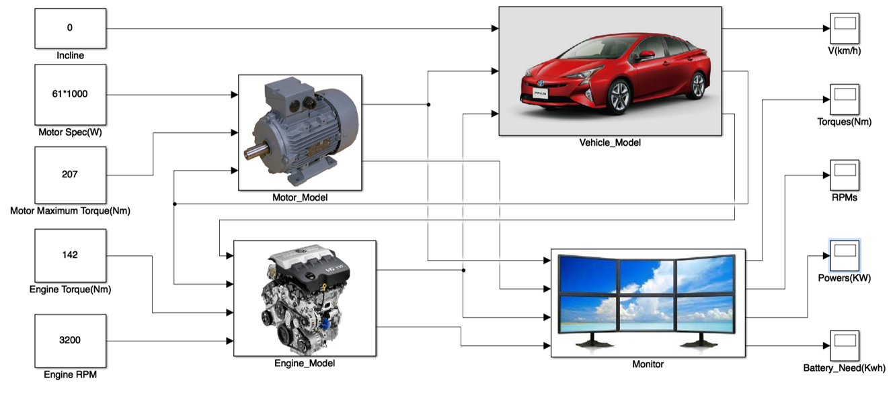

Graduation Thesis
========

## Image
 

 
한양대학교 미래자동차공학과 학사 졸업 논문
 
입력 분기 방식 하이브리드 자동차의 동특성 분석을 통한 모터, 배터리 용량 산정

## 개발 환경
 Matlab_R2015b
 Simulink

## Content
1. Simulink Files - Parallel_Dynamic, Series_Dynamic, hev_parallel, hev_serires
2. <a href="https://github.com/proauto/Graduation-Thesis/blob/master/%EC%9E%85%EB%A0%A5%20%EB%B6%84%EA%B8%B0%20%EB%B0%A9%EC%8B%9D%20%ED%95%98%EC%9D%B4%EB%B8%8C%EB%A6%AC%EB%93%9C%20%EC%9E%90%EB%8F%99%EC%B0%A8%EC%9D%98%20%EB%8F%99%ED%8A%B9%EC%84%B1%20%EB%B6%84%EC%84%9D%EC%9D%84%20%ED%86%B5%ED%95%9C%20%EB%AA%A8%ED%84%B0%2C%20%EB%B0%B0%ED%84%B0%EB%A6%AC%20%EC%9A%A9%EB%9F%89%20%EC%82%B0%EC%A0%95.docx">논문 docx 파일</a>
3. <a href="https://github.com/proauto/Graduation-Thesis/blob/master/%EC%A1%B8%EC%97%85%ED%8F%AC%EC%8A%A4%ED%84%B0.pptx">졸업포스터 - 한장으로 요약</a>

